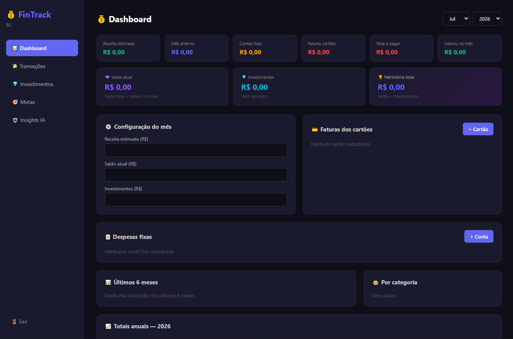

# 💰 FinTrack

> Sistema completo de gestão financeira pessoal com análise por Inteligência Artificial

**🔗 [Acesse o app ao vivo](https://fintrack-web-ivory.vercel.app/login)** · **[API em produção](https://fintrackapi-production-3f21.up.railway.app/health)**


---

## 📸 Preview

<!-- Adicione aqui um print do dashboard -->


## ✨ Funcionalidades

- 🔐 **Autenticação completa** — registro, login, JWT com access + refresh token
- 📊 **Dashboard financeiro** — receita estimada, saldo calculado automaticamente, patrimônio total
- 💳 **Controle de cartões** — cartões personalizáveis com faturas mensais e totais anuais
- 📋 **Despesas fixas** — controle de contas com status pago/pendente por mês
- 💸 **Transações** — CRUD completo com filtros, paginação e categorias
- 💎 **Carteira de investimentos** — tipos personalizados, rentabilidade, distribuição
- 🧮 **Calculadora de juros compostos** — com gráfico de evolução
- 🎯 **Metas financeiras** — progresso automático com barra visual
- 🤖 **Insights com IA** — análise financeira personalizada via Google Gemini
- 📱 **Design responsivo** — funciona em desktop e mobile

## 🛠️ Stack

**Backend**
- Node.js + TypeScript + Express
- PostgreSQL (queries SQL nativas com agregações)
- Redis (cache e sessões)
- JWT (autenticação com refresh token)
- Zod (validação de dados)
- Google Gemini AI (análise financeira)

**Frontend**
- React 18 + TypeScript + Vite
- React Query (sincronização com API)
- Zustand (estado global)
- Recharts (gráficos)
- React Router (navegação SPA)

**DevOps**
- Docker + Docker Compose (ambiente local)
- GitHub Actions (CI com testes automatizados)
- Railway (deploy backend + PostgreSQL)
- Vercel (deploy frontend)

## 🏗️ Arquitetura

```
fintrack/
├── apps/
│   ├── api/                  # Backend Node.js
│   │   └── src/
│   │       ├── controllers/  # Camada de requisição/resposta
│   │       ├── services/     # Lógica de negócio
│   │       ├── routes/       # Definição de endpoints
│   │       ├── middlewares/  # Auth JWT, cache Redis
│   │       ├── db/           # Cliente PostgreSQL + migrations
│   │       └── __tests__/    # Testes com Jest + Supertest
│   └── web/                  # Frontend React
│       └── src/
│           ├── pages/        # Telas da aplicação
│           ├── components/   # Componentes reutilizáveis
│           ├── hooks/        # React Query hooks
│           ├── services/     # Cliente HTTP (axios)
│           └── store/        # Estado global (Zustand)
├── .github/workflows/        # Pipeline CI/CD
└── docker-compose.yml        # PostgreSQL + Redis + pgAdmin
```

## 🚀 Como rodar localmente

### Pré-requisitos
- Node.js 20+
- Docker e Docker Compose

### Passo a passo

```bash
# 1. Clone o repositório
git clone https://github.com/dev-alef/fintrack.git
cd fintrack

# 2. Suba o banco e o Redis
docker compose up -d

# 3. Configure as variáveis de ambiente
cp apps/api/.env.example apps/api/.env
cp apps/web/.env.example apps/web/.env

# 4. Instale as dependências
npm install

# 5. Rode as migrations
cd apps/api
npm run migrate && npm run migrate:v2 && npm run migrate:v3
cd ../..

# 6. Inicie o projeto (API + Web juntos)
npm run dev
```

- **API:** http://localhost:3001
- **Web:** http://localhost:5173
- **pgAdmin:** http://localhost:5050

## 🧪 Testes

```bash
cd apps/api
npm test
```

10 testes cobrindo autenticação (registro, login, tokens, senhas inválidas) e transações (CRUD, filtros, autorização, validação).

## 📡 Principais endpoints

| Método | Rota | Descrição |
|--------|------|-----------|
| POST | `/auth/register` | Criar conta |
| POST | `/auth/login` | Login (retorna access + refresh token) |
| POST | `/auth/refresh` | Renovar access token |
| GET | `/transactions` | Listar com filtros e paginação |
| GET | `/transactions/summary` | Resumo com agregações SQL |
| GET | `/finance/cards` | Cartões de crédito |
| GET | `/finance/payments` | Contas fixas com status |
| GET | `/investments/portfolio` | Resumo da carteira |
| GET | `/insights` | Análise financeira com IA |

## 👨‍💻 Autor

**Alerson** — Fullstack Developer

- LinkedIn: [Alerson Ferreira](https://www.linkedin.com/in/alersonferreira/)
- GitHub: [@dev-alef](https://github.com/dev-alef)
- Genesis Code — Desenvolvimento de sistemas web

---

⭐ Se este projeto te ajudou de alguma forma, considere deixar uma estrela!
